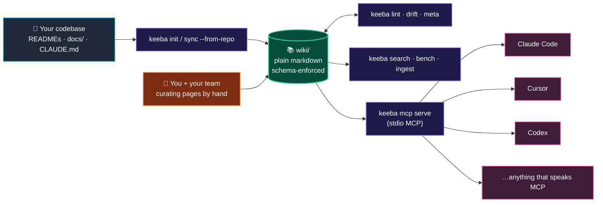

<div align="center">


# keeba

**Your AI tools are reading 50–2000× more bytes than they need to. keeba fixes that.**

A one-command bridge between your codebase and the AI tools you already use. Schema-clean wiki, drift-checked citations, MCP server out of the box, ingest agents that actually run. Pure Go. MIT.

[](https://github.com/aomerk/keeba/actions/workflows/ci.yml)
[](https://github.com/aomerk/keeba/releases)
[](https://pkg.go.dev/github.com/aomerk/keeba)
[](https://goreportcard.com/report/github.com/aomerk/keeba)
[](https://github.com/aomerk/keeba/blob/main/go.mod)
[](LICENSE)
[](https://github.com/aomerk/keeba/pulls)

[](https://github.com/aomerk/keeba/stargazers)
[](https://github.com/aomerk/keeba/network/members)
[](https://github.com/aomerk/keeba/issues)
[](https://github.com/aomerk/keeba/commits/main)
[](https://github.com/aomerk/keeba)
[](https://github.com/aomerk/keeba/releases)

</div>

---

```text
keeba: 2465.9× cheaper, 80.1× faster (5 questions; byte-count mode)
```

— measured on Karpathy's [`llm.c`](https://github.com/karpathy/llm.c), recipe + numbers checked into [`examples/llm-c/`](examples/llm-c/).

---

## 60 seconds, end to end

```bash
# install
go install github.com/aomerk/keeba/cmd/keeba@latest

# bootstrap a wiki from any codebase you already have
keeba init my-wiki --from-repo ../my-codebase
cd my-wiki

# wire it into Claude Code (or Cursor / Codex)
keeba mcp install --tool claude-code

# now Claude Code can search and answer over your wiki via MCP.
# refresh whenever upstream docs change — your hand-edits are preserved
keeba sync --from-repo ../my-codebase
```

That's it. Open Claude Code in `my-wiki/`, ask "how does auth work in my-codebase?" — it queries keeba's MCP server, reads the relevant chunks, answers.

---

## What you get

| Command | Job |
|---|---|
| `keeba init [name]` | Scaffold a wiki: SCHEMA, index, log, agents, lint + meta workflows, `.mcp.json`. |
| `keeba init --from-repo PATH` | Same, plus auto-import README / CLAUDE.md / ARCHITECTURE.md / CONTRIBUTING.md / `docs/**` / nested READMEs. Pages are wrapped with valid frontmatter and pass `keeba lint` out of the gate. |
| `keeba sync --from-repo PATH` | Re-import deltas. Pristine pages get refreshed. **Pages you edited are preserved.** Hash-based — explicit escape hatch. |
| `keeba lint` | Schema rules: title, summary, sources, see-also, wikilinks, filename casing, frontmatter required fields. |
| `keeba drift` | Citation drift: every backtick `repo/path:line` cite gets verified against the file on disk (file exists, lines in bounds). |
| `keeba meta` | Builds `_meta.json` + `_xref/<repo>.json`. `--check` mode for CI. |
| `keeba search QUERY` | BM25 keyword search. Pure Go, no API key. |
| `keeba search --vector QUERY` | Embedding search via Voyage AI or OpenAI (BYO key). |
| `keeba index` | One-shot embed of every page → `.keeba-cache/vectors.gob`. |
| `keeba bench` | Token-savings benchmark vs reading raw sources. Two modes: byte-count (no key) and `--llm anthropic` (real Claude tokens + self-rated confidence). |
| `keeba ingest git --execute` | Heuristic git log walker. BREAKING / incident / ADR / dep-bump → `log.md` / `investigations/` / `decisions/`. No LLM, no API key. |
| `keeba mcp serve` | Stdio MCP server (protocol 2024-11-05). One tool: `query_documentation`. |
| `keeba mcp install --tool {claude-code,cursor,codex}` | Wires keeba's MCP server into the chosen tool. Idempotent. |

---

## Why this exists

Every team eventually rebuilds the same thing: schema-clean wiki + ingest agents + drift detection + MCP integration. keeba is that, productized.

The thesis: there's a hole between "DIY with LangChain" (a 3-week project) and "Notion subscription" (vendor lock + closed ecosystem). keeba lives in it.

| Tool | What it does | What keeba adds |
|---|---|---|
| **graphify** | One-shot: code → knowledge graph | Ongoing maintenance, sync, ingest, MCP |
| **LangChain RAG starters** | Retrieval pipeline | Schema discipline, drift detection, multi-tool MCP, day-1 demo |
| **Obsidian** | Local Markdown KB | Cloud sync, agents, AI-tool wiring |
| **Notion AI** | Cloud KB with built-in LLM | OSS, agnostic, terminal-native, no vendor lock |
| **Pinecone/Weaviate starters** | Vector DB | Full lifecycle including human-curated narrative |

The moat isn't retrieval. It's **the durable loop**: import → curate → sync without losing curation. Most KB products bleed signal at the edges of that loop. keeba's whole job is plugging them.

---

## Real numbers

From [`examples/llm-c/_bench/2026-04-28.md`](examples/llm-c/_bench/2026-04-28.md), captured by running keeba against a fresh `karpathy/llm.c` clone:

| | Wiki mode | Raw mode | Ratio |
|---|---|---|---|
| Tokens consumed | 122 | 300,840 | **2465× cheaper** |
| Wall time | 36µs | 2.9ms | **80× faster** |

That's the byte-count bench. The LLM bench (`keeba bench --llm anthropic`) gets the same shape with smaller absolute numbers because Claude reads context smarter than a `cat` does — the API token counts come straight from the response, plus the model self-rates its confidence 1–5.

---

## Architecture (one diagram, no more)



`wiki/` is plain markdown. Schema is enforced (`keeba lint`), not assumed. Citations are verified (`keeba drift`). MCP is the wire format. No vendor lock at any layer.

---

## Status: pre-alpha

What works today (verified end-to-end on real codebases):

- ✅ `init`, `init --from-repo`, `sync --from-repo`
- ✅ `lint`, `drift`, `meta`
- ✅ `search` (BM25), `search --vector` (Voyage / OpenAI)
- ✅ `bench`, `bench --llm anthropic`
- ✅ `ingest git --execute` (heuristic, no LLM)
- ✅ `mcp serve`, `mcp install` (Claude Code, Cursor, Codex)

What's v0.4+:

- Section-level chunking for finer-grained search
- Local sentence-transformers embedder (cybertron + ONNX MiniLM)
- Direct Slack ingest execution (currently template-only)
- Homebrew tap
- 30-second screencast demo

---

## Configuration

`keeba.config.yaml` at the wiki root drives everything. Sensible defaults — every command works without the file.

```yaml
schema_version: 1
name: "my-wiki"
purpose: "Knowledge base for the foo team."

lint:
  required_frontmatter_fields: [tags, last_verified, status]
  valid_status_values: [current, draft, archived, deprecated, proposed]

drift:
  # Without prefixes, drift never flags. Add the repos you cite from:
  repo_prefixes: ["my-app/", "my-infra/"]
  gigarepo_root: ".."
```

---

## Examples

- [`examples/llm-c/`](examples/llm-c/) — full recipe + checked-in bench numbers against Karpathy's llm.c.

If you run it on a corpus and the ratio is interesting, open a PR with `examples/<your-corpus>/` — community bench numbers welcome.

---

## Install

```bash
go install github.com/aomerk/keeba/cmd/keeba@latest
keeba --version
```

Requires Go 1.22+. Homebrew tap lands at v0.4.

---

## License

[MIT](LICENSE). Use it, fork it, ship a SaaS on top of it. Just don't sue me.

---

🤖 Built with [Claude Code](https://claude.com/claude-code) — keeba uses the same loop on its own development.
