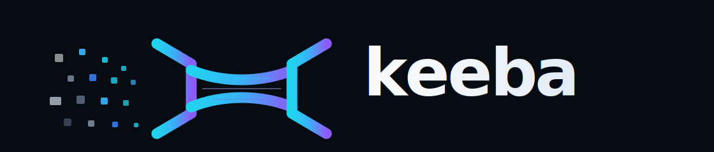
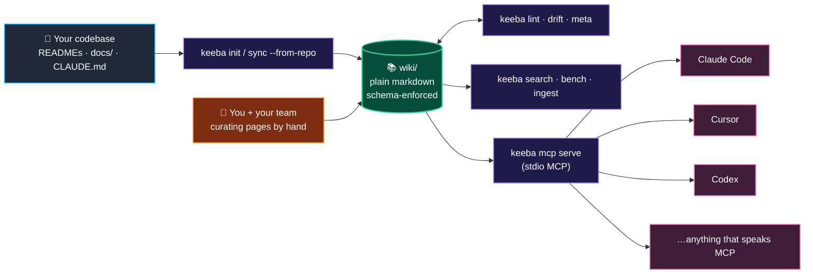

<div align="center">



# keeba

**~30% cheaper Claude Code sessions on real codebases. Same answer, fewer tokens. Verified, not vibes.**

A one-command bridge between your codebase and the AI tools you already use. Symbol graph + MCP server out of the box, schema-clean wiki, drift-checked citations, ingest agents that actually run. Pure Go. MIT.

[](https://github.com/aomerk/keeba/actions/workflows/ci.yml)
[](https://github.com/aomerk/keeba/releases)
[](https://pkg.go.dev/github.com/aomerk/keeba)
[](https://goreportcard.com/report/github.com/aomerk/keeba)
[](https://github.com/aomerk/keeba/blob/main/go.mod)
[](LICENSE)
[](https://github.com/aomerk/keeba/pulls)

[](https://github.com/aomerk/keeba/stargazers)
[](https://github.com/aomerk/keeba/network/members)
[](https://github.com/aomerk/keeba/issues)
[](https://github.com/aomerk/keeba/commits/main)
[](https://github.com/aomerk/keeba)
[](https://github.com/aomerk/keeba/releases)

</div>

---

```text
keeba arm:    $1.45  (693k cache_read, 10.3k output, 2m47s API)
no-keeba arm: $2.19  (1.10M cache_read, 12.4k output, 3m38s API)
              ─────
              −34% per session, both arms found the same 2 bugs at the same file:line cites
```

— A real bug investigation, run twice in Claude Code (Opus 4.7) on a private Go codebase. Both arms found the same 2 bugs at the same file:line citations. Reproduce on yours: see the [Verify it on your repo](#verify-it-on-your-repo) section below.

---

## 60 seconds, end to end (symbol graph — the −34% path)

```bash
# install
go install github.com/aomerk/keeba/cmd/keeba@latest

# point at any code repo and compile its symbol graph
cd ~/my-go-repo
keeba compile .

# wire it into Claude Code AND apply every UX patch keeba ships with.
# (the install registers the MCP server; the four flags fix the routing
# AND attack the output-token bloat that ceilings session savings.)
#   --patch-agents      — add mcp__keeba__* to user-defined sub-agents
#   --with-claude-md    — assertive routing rules in ~/.claude/CLAUDE.md
#   --with-hook         — pre-ground every prompt with symbol-graph evidence
#   --with-output-style — terse engineering style; no preamble, no restatement,
#                         no closing summary (activate per-session with
#                         /output-style keeba)
keeba mcp install --tool claude-code \
  --patch-agents --with-claude-md --with-hook --with-output-style

# restart Claude Code, then ask any "where is X / what calls Y / what
# tests cover Z" question. /cost after to see the receipt.
```

Restart matters — Claude only re-reads MCP config and CLAUDE.md on launch.

## 60 seconds, end to end (wiki — for human-curated docs)

```bash
# bootstrap a wiki from any codebase you already have
keeba init my-wiki --from-repo ../my-codebase
cd my-wiki

# wire it into Claude Code (or Cursor / Codex)
keeba mcp install --tool claude-code

# refresh whenever upstream docs change — your hand-edits are preserved
keeba sync --from-repo ../my-codebase
```

Open Claude Code in `my-wiki/`, ask "how does auth work in my-codebase?" — it queries keeba's MCP server, reads the relevant chunks, answers.

---

## What you get

| Command | Job |
|---|---|
| `keeba init [name]` | Scaffold a wiki: SCHEMA, index, log, agents, lint + meta workflows, `.mcp.json`. |
| `keeba init --from-repo PATH` | Same, plus auto-import README / CLAUDE.md / ARCHITECTURE.md / CONTRIBUTING.md / `docs/**` / nested READMEs. Pages are wrapped with valid frontmatter and pass `keeba lint` out of the gate. |
| `keeba sync --from-repo PATH` | Re-import deltas. Pristine pages get refreshed. **Pages you edited are preserved.** Hash-based — explicit escape hatch. |
| `keeba lint` | Schema rules: title, summary, sources, see-also, wikilinks, filename casing, frontmatter required fields. |
| `keeba drift` | Citation drift: every backtick `repo/path:line` cite gets verified against the file on disk (file exists, lines in bounds). |
| `keeba meta` | Builds `_meta.json` + `_xref/<repo>.json`. `--check` mode for CI. |
| `keeba search QUERY` | BM25 keyword search. Pure Go, no API key. |
| `keeba search --vector QUERY` | Embedding search via Voyage AI or OpenAI (BYO key). |
| `keeba index` | One-shot embed of every page → `.keeba-cache/vectors.gob`. |
| `keeba compile [path]` | Extract a symbol graph (functions / methods / types + call edges) into `.keeba/symbols.json`. Pure Go, no LLM. Powers the symbol-graph MCP tools below. Self-maintains via fsnotify while `mcp serve` is running. |
| `keeba bench` | Token-savings benchmark. Three modes: byte-count (no key, wiki vs raw), `--llm anthropic` (real Claude tokens + self-rated confidence), and `--mcp <repo>` (symbol-graph receipt against any code repo, writes `bench/results/<repo>-<date>.md`). |
| `keeba ingest git --execute` | Heuristic git log walker. BREAKING / incident / ADR / dep-bump → `log.md` / `investigations/` / `decisions/`. No LLM, no API key. |
| `keeba mcp serve` | Stdio MCP server (protocol 2024-11-05). 9 tools: `query_documentation` (BM25 wiki), `find_def` / `search_symbols` / `grep_symbols` / `find_callers` / `tests_for` / `summary` / `read_chunk` (symbol graph), `session_stats` (live savings receipt). |
| `keeba mcp install --tool {claude-code,cursor,codex}` | Wires keeba's MCP server into the chosen tool. Idempotent. |

---

## Why this exists

Every team eventually rebuilds the same thing: schema-clean wiki + ingest agents + drift detection + MCP integration. keeba is that, productized.

The thesis: there's a hole between "DIY with LangChain" (a 3-week project) and "Notion subscription" (vendor lock + closed ecosystem). keeba lives in it.

| Tool | What it does | What keeba adds |
|---|---|---|
| **graphify** | One-shot: code → knowledge graph | Ongoing maintenance, sync, ingest, MCP |
| **LangChain RAG starters** | Retrieval pipeline | Schema discipline, drift detection, multi-tool MCP, day-1 demo |
| **Obsidian** | Local Markdown KB | Cloud sync, agents, AI-tool wiring |
| **Notion AI** | Cloud KB with built-in LLM | OSS, agnostic, terminal-native, no vendor lock |
| **Pinecone/Weaviate starters** | Vector DB | Full lifecycle including human-curated narrative |

The moat isn't retrieval. It's **the durable loop**: import → curate → sync without losing curation. Most KB products bleed signal at the edges of that loop. keeba's whole job is plugging them.

---

## Real numbers

### What you actually save — real Claude Code A/B

A real bug-investigation prompt run twice in Claude Code (Opus 4.7, xhigh effort) on a private Go codebase, once with keeba MCP wired up, once with `--strict-mcp-config /dev/null`. Both arms found the same two bugs at the same file:line citations.

| | keeba arm | no-keeba arm | Δ |
|---|---|---|---|
| **Cost** | **$1.45** | **$2.19** | **−34% (saved $0.74)** |
| **cache_read** | **693k** | **1.10M** | **−37% (407k tokens)** |
| cache_write | 135k | 210k | −36% |
| Output tokens | 10.3k | 12.4k | similar |
| API time | 2m 47s | 3m 38s | keeba faster |
| Wall time | 5m 25s | 4m 16s | keeba slower (more roundtrips) |
| Bugs found | 2, file:line cites | 2, file:line cites | parity |

**Headline: ~30% cheaper per session, with quality parity.** `cache_read` is the lever — keeba surfaces evidence in 6 KiB markdown blobs instead of 100+ KiB whole-file reads.

Caveats spelled out (not papered over):

- **One investigation, one prompt** — order-of-magnitude, your number will vary ±10%. Impact-tracing / "what depends on this" / onboarding prompts benefit most. Write-from-scratch prompts barely move.
- **Wall time was slightly slower for keeba** (more tool roundtrips, smaller payloads each). API time and cost both went the right way.
- **Even with keeba registered, Claude needed an explicit "use keeba" prompt nudge.** Without it, training-default Read/Grep wins. `keeba mcp install --tool claude-code --patch-agents --with-claude-md` adds CLAUDE.md guidance to steer the agent — the assertiveness of that guidance is iterating.

#### Verify it on your repo

Don't trust the headline — measure it on your own codebase:

```bash
keeba compile .                       # ~1s for 5k symbols
keeba bench --hook-prompts $(pwd)     # 7-prompt panel, codec A/B
```

Reports per-prompt byte deltas + aggregate mean savings. **Privacy guard**: only basenames + metric counts cross into the output, never source content from your repo. Safe to run on private codebases.

End-to-end `/cost` A/B in Claude Code is the real test — bytes saved on injection don't translate 1:1 to dollars saved (extra `find_def`/`read_chunk` round-trips eat some back). Same prompt, two terminals, `/cost` after each.

### Tool-level capability — `ethereum/go-ethereum` (1,405 .go files)

From [`bench/results/go-ethereum.md`](bench/results/go-ethereum.md). This measures the keeba **tools themselves** (returned-bytes vs what an unfiltered `read_file` agent would have pulled), not Claude session cost. Useful as a capacity sanity-check, not as a per-session savings claim — see the A/B table above for that.

| Metric | Value |
|---|---|
| Symbols | 20,065 |
| Call edges | 138,431 |
| Compile time | ~8 s |
| Index on disk | 27.6 MiB (~1.4 KiB/symbol) |
| `bytes_returned` across 9 queries | 41.7 KiB |
| `bytes_alternative` (read_file equivalent) | 29.7 MiB |
| **Tool-level ratio** | **721× cheaper, ~7.7M alternative tokens** |

Per-query latencies: `find_def` 0 ms (hash lookup), `find_callers` 0 ms (inverted index), `search_symbols` 7–10 ms (BM25 over 20k docs), `summary` 14 ms, `tests_for` 31 ms, `grep_symbols` 20–245 ms (regex sweep over function bodies).

Reproduce:

```bash
git clone --depth 1 https://github.com/ethereum/go-ethereum /tmp/go-ethereum
keeba bench --mcp /tmp/go-ethereum
```

### Wiki mode — `karpathy/llm.c`

From [`examples/llm-c/_bench/2026-04-28.md`](examples/llm-c/_bench/2026-04-28.md). The original BM25-wiki vs raw-files bench. Same caveat as above: this is the wiki tool's capacity, not a per-session savings claim.

| | Wiki mode | Raw mode | Ratio |
|---|---|---|---|
| Tokens consumed | 122 | 300,840 | **2465× tool-level cheaper** |
| Wall time | 36µs | 2.9ms | **80× faster** |

LLM bench (`keeba bench --llm anthropic`) gets the same shape with smaller absolute numbers — Claude reads context smarter than `cat` does. The model self-rates its confidence 1–5.

---

## Architecture (one diagram, no more)



`wiki/` is plain markdown. Schema is enforced (`keeba lint`), not assumed. Citations are verified (`keeba drift`). MCP is the wire format. No vendor lock at any layer.

---

## Status: pre-alpha

What works today (verified end-to-end on real codebases):

- ✅ `init`, `init --from-repo`, `sync --from-repo`
- ✅ `lint`, `drift`, `meta`
- ✅ `search` (BM25), `search --vector` (Voyage / OpenAI)
- ✅ `bench`, `bench --llm anthropic`, `bench --mcp` (verified on go-ethereum, see numbers above)
- ✅ `compile` — symbol graph extraction (Go AST + regex extractors for py/js/ts/rs/java/kt/rb/c/cpp), self-maintaining via fsnotify
- ✅ `ingest git --execute` (heuristic, no LLM)
- ✅ `mcp serve`, `mcp install` (Claude Code, Cursor, Codex) — 9 tools including `find_def`, `search_symbols`, `grep_symbols`, `find_callers`, `tests_for`, `summary`, `read_chunk`, `session_stats`

What's v0.4+:

- Section-level chunking for finer-grained search
- Local sentence-transformers embedder (cybertron + ONNX MiniLM)
- Direct Slack ingest execution (currently template-only)
- Homebrew tap
- 30-second screencast demo

---

## Configuration

`keeba.config.yaml` at the wiki root drives everything. Sensible defaults — every command works without the file.

```yaml
schema_version: 1
name: "my-wiki"
purpose: "Knowledge base for the foo team."

lint:
  required_frontmatter_fields: [tags, last_verified, status]
  valid_status_values: [current, draft, archived, deprecated, proposed]

drift:
  # Without prefixes, drift never flags. Add the repos you cite from:
  repo_prefixes: ["my-app/", "my-infra/"]
  gigarepo_root: ".."
```

---

## Examples

- [`examples/llm-c/`](examples/llm-c/) — full recipe + checked-in bench numbers against Karpathy's llm.c.

If you run it on a corpus and the ratio is interesting, open a PR with `examples/<your-corpus>/` — community bench numbers welcome.

---

## Install

```bash
go install github.com/aomerk/keeba/cmd/keeba@latest
keeba --version
```

Requires Go 1.22+. Homebrew tap lands at v0.4.

---

## License

[MIT](LICENSE). Use it, fork it, ship a SaaS on top of it. Just don't sue me.

---

🤖 Built with [Claude Code](https://claude.com/claude-code) — keeba uses the same loop on its own development.
